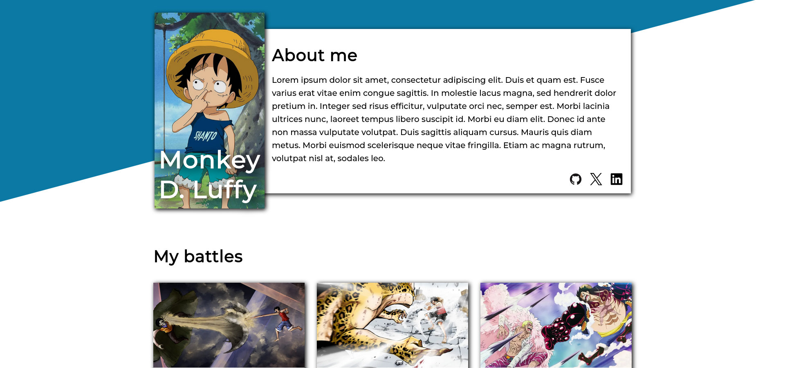

    
    <h1>myHomepage </h1>
    
My first homepage

    

        <a href="https://jotafer19.github.io/homepage/" target="_blank" rel="noreferrer noopener">View Demo</a> · 
        <a href="https://github.com/jotafer19/homepage/issues" target="_blank" rel="noreferrer noopener">Report Bug</a> ·
        <a href="https://github.com/jotafer19/homepage/issues" target="_blank" rel="noreferrer noopener"> Request Feature</a>
    

## Preview

### Features

- A webpage built to show my portfolio.
- Build using responsive design and with accessibility in mind.
- Clean for better visuals, with indicators for possible errors.

### Built With

- 
- 
- 

### Tools Used

- 
- 
- 

## Outcome

- Used CSS **`grid`** and **`flex`** to manage layout.
- Used **`<picture>`** and **`<srcset>`** to optimize images.
- a11y friendly.
- Used **Git** and **GitHub** for project management.
- Tried to maintain **clean code**.

## What I learned

- How to build accessible webpages.
- Better understanding of responsive design.
- A lot of minor things.

## Acknowledgments

- Inspiration by [**The Odin Project**](https://www.theodinproject.com/lessons/node-path-advanced-html-and-css-homepage#project-solution).
